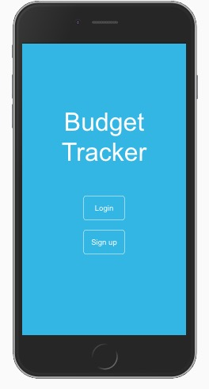

# Budget Tracker

The aim of this project was to build a tracking app using a REST Api and React front-end.



## Live Demo

Click [here](https://king-budget-tracker.herokuapp.com/) to see a live demo.

## Built With

This app was built using the following:
- React
- Redux
- ES6
- NPM
- Heroku

## Getting Started

* Click the live link provided or clone the repo using the following link:

```
https://github.com/KerronKing/budget-tracker.git
```

* cd into the project directory and run 'npm start'

## Using the App

* Login or signup using links provided.
* Use the footer to navigate across the app.
* Click 'Create new budget' to create a new budget.
* Click on the budget title, once create, to see your budget's details.
* Click 'New total' to add daily expenditure info.
* Click 'Totals' to see that budget's daily expenditure totals.

## Contributing

Contributions, issues and feature requests are welcome!

## Show your support

Feel free to drop a :+1: to show your support. It'd be greatly appreciated it :pray:

## Author

:bust_in_silhouette: Kerron King

* Github: [@KerronKing](https://github.com/KerronKing)

* Twitter: [@KerronTriniDev](https://twitter.com/kerrontrinidev)

* Linkedin: [Kerron King](linkedin.com/in/kerron-shawn-king)

## License :memo:

This work is a derivative of "Bodytrack.it" by Gregoire Vella, used under
the [CC BY-NC-ND 4.0](https://creativecommons.org/licenses/by-nc-nd/4.0/)